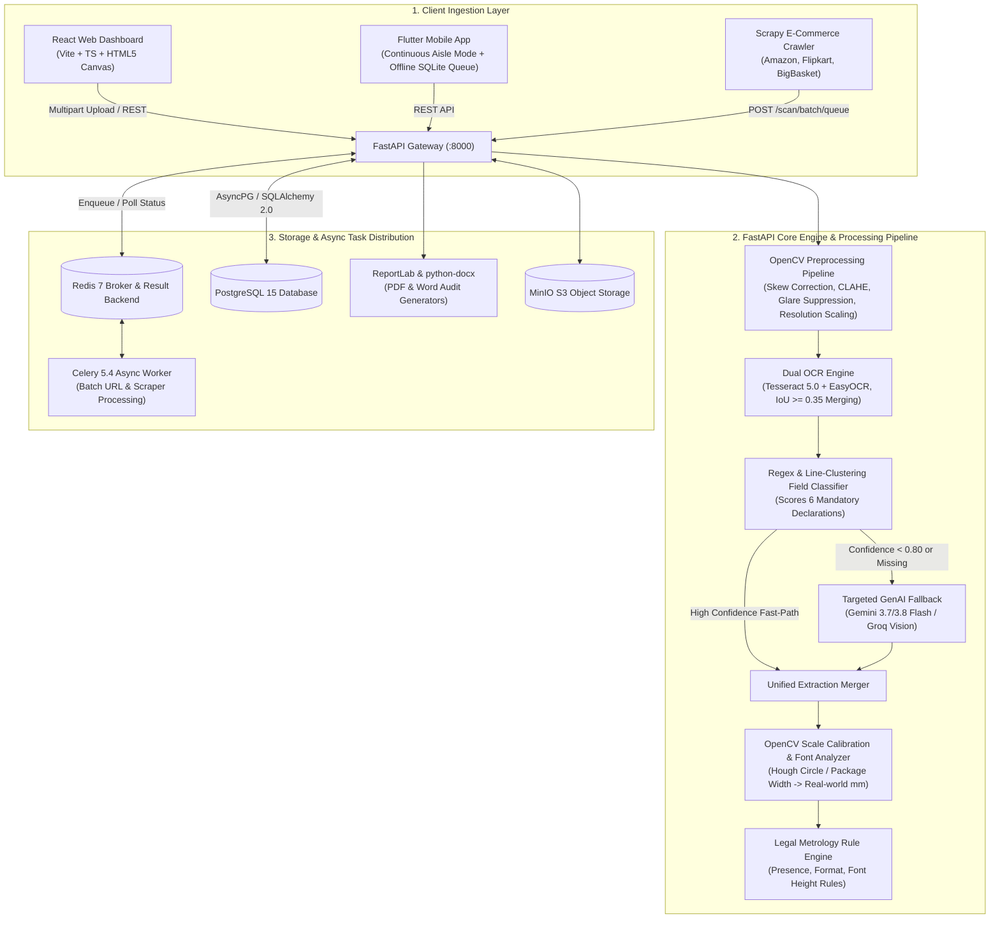

# 📦 ComplianceScanner AI — Comprehensive Project Dossier & Architecture Reference

> **Document Purpose**: Complete technical dossier, architecture blueprint, algorithmic methodology, and codebase map for **ComplianceScanner AI**. Designed for technical review, system handoff, and cross-AI pairing.

---

## 1. Executive Summary & Problem Space

**ComplianceScanner AI** is an enterprise-grade, automated inspection platform engineered to audit retail packaging and e-commerce product listings against statutory Indian consumer protection and legal standards:
* **Legal Metrology (Packaged Commodities) Rules, 2011** (specifically Rules 6, 7, and Table I)
* **FSSAI (Food Safety and Standards Authority of India) Packaging and Labelling Regulations**

### Core Inspection Mandates
1. **Mandatory Declarations Verification**: Checks for the explicit presence of:
   * Maximum Retail Price (`mrp`) including statutory inclusive-of-taxes terminology.
   * Net Quantity (`net_quantity`) with metric units (g, kg, ml, L).
   * Date of Manufacture / Packing / Expiry (`manufacture_date`).
   * Complete Name & Physical Address of the Manufacturer / Packer / Importer (`manufacturer_name_address`).
   * Consumer Care Contact Channels (`consumer_care_details`) — telephone, email, and website.
   * Country of Origin (`country_of_origin`).
   * Unit Sale Price (`unit_sale_price` / USP) where statutorily mandated.
2. **Statutory Font Size Compliance**: Measures actual physical text heights in millimeters against packaging size/weight tiers to ensure statutory legibility.
3. **Violation Categorization**:
   * `missing`: Obligatory declaration is completely absent from the label.
   * `incorrect_format`: Text is present but deviates from mandated phrasing or units.
   * `undersized_font`: Font height is below statutory minimum millimeter thresholds.

---

## 2. High-Level Architecture



---

## 3. Technology Stack Breakdown

| Layer / Subsystem | Technology | Purpose & Implementation Details |
| :--- | :--- | :--- |
| **API Framework** | **FastAPI 0.115**, Uvicorn, Pydantic v2 | High-throughput asynchronous REST server with lifespan management, CORS, schema validation, and OpenAPI documentation (`/docs`, `/redoc`). |
| **Relational Database** | **PostgreSQL 15**, SQLAlchemy 2.0 (Async), AsyncPG | Asynchronous connection pooling and ORM models for Users, Products, Scans, Violations, and Inspection Histories. |
| **Database Migrations** | **Alembic** | Async migration pipeline tracking schema versions in `alembic/versions`. |
| **Async Task Queue** | **Celery 5.4**, **Redis 7** | Non-blocking background workers handling bulk URL and crawler batches with granular progress tracking (`"45/100 processed"`). |
| **Object Storage** | **MinIO (S3-compatible)** | Stores raw packaging photographs, cropped field regions, and generated inspection audit reports. |
| **Computer Vision** | **OpenCV 4.x (`cv2`)**, NumPy | Probabilistic Hough Line text deskewing, LAB CLAHE contrast boost, specular glare attenuation, and Hough Circle scale calibration. |
| **Dual OCR Engine** | **Tesseract 5.0**, **EasyOCR** (PyTorch) | Dual-engine OCR with normalized `[x, y, w, h]` bounding boxes, IoU overlap deduplication, and confidence arbitration. |
| **Targeted GenAI Vision**| **Google GenAI SDK** (`gemini-3.7-flash`, `gemini-3.8-flash`), **Groq Vision** | Cost-optimized targeted fallback triggered strictly for low-confidence or missing fields using structured JSON schemas. |
| **Statutory Rule Engine**| Custom Rules & JSON Config | Enforces Legal Metrology 2011 rules and package size-to-font height tables. |
| **Report Generation** | **ReportLab 4.x**, **python-docx** | Programmatic compilation of official PDF audit certificates and editable Microsoft Word (`.docx`) dossiers. |
| **Authentication & RBAC**| **PyJWT**, **Passlib (bcrypt)** | Stateless JWT token authentication enforcing Role-Based Access Control (**Admin**, **Inspector**, **Viewer**). |
| **Web Dashboard** | **React 18**, **TypeScript**, **Vite**, **TailwindCSS**, **Recharts** | Inspector UI featuring an interactive HTML5 Canvas bounding box overlay, inspection reports, batch uploading, and analytics. |
| **Mobile Application** | **Flutter 3.35**, **Dart** | Field inspector mobile client supporting camera frame capture, continuous store aisle capture, and SQLite offline queueing. |
| **E-Commerce Scraper** | **Scrapy 2.11** | Category crawler extracting product images and titles from Amazon, Flipkart, and BigBasket with auto-staging. |
| **Containerization** | **Docker & Docker Compose** | 6 orchestrated services: `compliance-postgres`, `compliance-redis`, `compliance-minio`, `compliance-backend`, `compliance-celery-worker`, `compliance-frontend`. |

---

## 4. End-to-End Processing Methodology

### Phase 1: Robust Image Ingestion & Normalization
1. **Multi-Source Ingestion**: Accepts multipart single/batch file uploads, direct camera snapshots, or remote HTTP/S URLs.
2. **Decoding & Format Handling**: Uses OpenCV `imdecode` with an automated fallback to PIL (handling HEIC, TIFF, and WebP). RGBA images are converted to 3-channel BGR.
3. **Dynamic Dimension Scaling**:
   * Images $> 3000\text{px}$ are downscaled via `cv2.INTER_AREA` to eliminate memory spikes.
   * Images $< 1600\text{px}$ are upscaled via `cv2.INTER_CUBIC` to ensure small package text (1.5mm–2.5mm) remains legible for OCR.

### Phase 2: Computer Vision Preprocessing
Implemented in [`image_preprocessing.py`](file:///e:/compliance-scanner/backend/app/services/image_preprocessing.py):
1. **Probabilistic Hough Line Deskewing**:
   * Greyscale conversion $\to$ Gaussian blur $\to$ Canny edge detection.
   * Probabilistic Hough transform (`cv2.HoughLinesP`) extracts candidate line segments.
   * Filters for horizontal angles ($-45^\circ \le \theta \le +45^\circ$) and computes length-weighted median skew angle.
   * Canvas is rotated via `cv2.warpAffine` using median border color padding to avoid artificial black edges.
2. **LAB CLAHE & Glare Suppression**:
   * Image is converted to LAB color space.
   * Contrast-Limited Adaptive Histogram Equalization (CLAHE) is applied to the L-channel (clip limit $2.0$, tile grid $8\times 8$).
   * Specular highlights ($L > 230$) are compressed using a soft roll-off formula ($L_{\text{new}} = 230 + (L - 230) \times 0.4$) to suppress camera flash reflections.

### Phase 3: Dual-Engine OCR Execution
Implemented in [`ocr_engine.py`](file:///e:/compliance-scanner/backend/app/services/ocr_engine.py):
* **Tesseract Path**: Runs Tesseract PSM 6 with bounding box extraction via `image_to_data`.
* **EasyOCR Path**: Converts irregular quadrilaterals to axis-aligned bounding boxes `[x, y, w, h]`.
* **IoU Deduplication**: Bounding boxes with $\text{IoU} \ge 0.35$ are treated as identical text regions; the engine producing higher confidence is retained.

### Phase 4: Line Clustering & Statutory Field Classification
Implemented in [`field_classifier.py`](file:///e:/compliance-scanner/backend/app/services/field_classifier.py):
1. **Vertical Line Clustering**: Groups text blocks where vertical offsets satisfy $|\Delta y| \le 25\text{px}$.
2. **Regex Rule Scoring**: Matches against curated regex patterns for each mandatory declaration:
   * `mrp`: Detects `MRP`, `M.R.P.`, `Maximum Retail Price`, `Rs.`, `₹`, and `inclusive of all taxes`.
   * `net_quantity`: Detects units (`g`, `gm`, `kg`, `ml`, `l`, `pcs`, `N`) and compound expressions (e.g. `50g + 10g free = 60g`).
   * `manufacture_date`: Extracts standard date formats (`MM/YYYY`, `DD/MM/YYYY`, `Best Before`, `Use By`, `Pkd Date`).
   * `manufacturer_name_address`: Identifies corporate entities (`Pvt Ltd`, `LLP`, `Industries`) and location keywords (`Industrial Area`, `PIN`, state codes).
   * `consumer_care_details`: Matches toll-free lines (`1800-xxx-xxxx`), email addresses, and URLs.
   * `country_of_origin`: Matches origin statements (e.g. `Country of Origin: India`).

### Phase 5: Cost-Optimized Targeted GenAI Fallback
Implemented in [`genai_extraction.py`](file:///e:/compliance-scanner/backend/app/services/genai_extraction.py) and [`scans.py`](file:///e:/compliance-scanner/backend/app/routers/scans.py):
* **Smart Hybrid Logic**:
  * **Fast Path**: If OCR extracts all 6 declarations with high confidence ($\ge 0.80$), GenAI is **completely skipped** ($0\text{ms}$ network latency, zero API costs).
  * **Targeted Gaps Path**: If fields are missing or confidence is $< 0.80$, the system constructs a targeted JSON prompt querying **only the specific missing keys** to Google Gemini Vision (`gemini-3.7-flash` / `gemini-3.8-flash`) or Groq Vision.
  * Successfully retrieved GenAI fields are seamlessly merged into the unified extraction payload.

### Phase 6: Sub-Millimeter Physical Font Measurement
Implemented in [`font_size_analyzer.py`](file:///e:/compliance-scanner/backend/app/services/font_size_analyzer.py):
1. **Scale Factor Determination**:
   * *Hough Circle Method*: Detects circular fiducial markers (e.g., standard ₹5 coin diameter $= 24.26\text{mm}$) via `cv2.HoughCircles` to establish $\text{pixels\_per\_mm} = \frac{\text{diameter}_{\text{px}}}{\text{diameter}_{\text{mm}}}$.
   * *Package Width Method*: Uses known package physical dimensions ($\text{pixels\_per\_mm} = \frac{\text{image\_width}_{\text{px}}}{\text{package\_width}_{\text{mm}}}$).
   * *Fallback*: Standard 300 DPI baseline ($\approx 11.81\text{ px/mm}$).
2. **Text Height Computation**: Computes font height $h_{\text{mm}} = \frac{h_{\text{px}}}{\text{pixels\_per\_mm}}$.

### Phase 7: Compliance Rule Engine Evaluation
Implemented in [`rule_engine.py`](file:///e:/compliance-scanner/backend/app/services/rule_engine.py):
* Validates statutory requirements based on net quantity package weight tiers:
  * Net quantity $\le 50\text{g} \implies \text{min font } 1.0\text{mm}$
  * Net quantity $50\text{g} - 200\text{g} \implies \text{min font } 1.5\text{mm}$ ($2.0\text{mm}$ for net qty declaration)
  * Net quantity $200\text{g} - 1000\text{g} \implies \text{min font } 4.0\text{mm}$
  * Net quantity $> 1000\text{g} \implies \text{min font } 6.0\text{mm}$
* Generates audit verdicts: `compliant`, `non_compliant`, or `partial_review_needed`.

---

## 5. Repository File Map & Modules

```
compliance-scanner/
├── backend/
│   ├── app/
│   │   ├── main.py                         # FastAPI setup, CORS, lifespan hooks, route registration
│   │   ├── core/
│   │   │   ├── config.py                   # Pydantic Settings reading environment variables
│   │   │   ├── database.py                 # Async SQLAlchemy engine, AsyncSessionLocal, get_db
│   │   │   ├── auth.py                     # JWT token encode/decode, bcrypt hashing, RBAC dependencies
│   │   │   └── celery_app.py               # Celery client connected to Redis broker
│   │   ├── models/
│   │   │   ├── user.py                     # User entity (roles: admin, inspector, viewer)
│   │   │   ├── product.py                  # Product entity (name, category, image url)
│   │   │   ├── scan.py                     # Scan entity (type, status, timestamps, relations)
│   │   │   ├── violation.py                # Violation entity (type, severity, rule reference, details)
│   │   │   └── inspection_history.py       # Inspection audit logs
│   │   ├── schemas/                        # Pydantic validation schemas for API endpoints
│   │   ├── routers/
│   │   │   ├── auth.py                     # /auth/login, /auth/register, /auth/me, /auth/users
│   │   │   ├── health.py                   # /health (Liveness and DB connectivity check)
│   │   │   ├── scans.py                    # /scan/batch, /scan/batch/queue, /scan/batch/{id}/status
│   │   │   └── reports.py                  # /reports/{scan_id}/pdf, /reports/{scan_id}/docx
│   │   ├── services/
│   │   │   ├── image_preprocessing.py      # Deskew, quad perspective, CLAHE, glare suppression
│   │   │   ├── ocr_engine.py               # Tesseract + EasyOCR dual-engine runner & IoU merger
│   │   │   ├── field_classifier.py         # Regex scoring, line clustering, field tagger
│   │   │   ├── font_size_analyzer.py       # Hough circle scale calibration & mm font measurement
│   │   │   ├── genai_extraction.py         # Gemini & Groq Vision API fallback callers
│   │   │   ├── rule_engine.py              # Legal Metrology 2011 rule validator
│   │   │   └── report_generator.py         # ReportLab PDF & python-docx report builders
│   │   └── tasks/
│   │       └── scan_tasks.py               # Celery async worker task definitions
│   ├── alembic/                            # Database migrations (asyncpg compatible)
│   ├── tests/                              # Pytest test suite (211+ tests)
│   └── requirements.txt                    # Python backend dependencies
├── compliance-dashboard/                  # React 18 + Vite Web Dashboard
│   ├── src/
│   │   ├── App.tsx                         # App routing, navigation, session state
│   │   ├── components/
│   │   │   ├── Navbar.tsx                  # Top header, role switcher, navigation links
│   │   │   └── BoundingBoxCanvas.tsx       # Canvas overlay rendering OCR bboxes with violation tags
│   │   ├── pages/
│   │   │   ├── LoginPage.tsx               # Auth view supporting JWT & Inspector demo bypass
│   │   │   ├── UploadPage.tsx              # Single & batch file dropzone, camera upload, metadata
│   │   │   ├── ScanResultPage.tsx          # Audit details, violation drawer, PDF/DOCX downloads
│   │   │   └── AnalyticsPage.tsx           # Recharts compliance ratios, failure types, category stats
│   │   └── services/
│   │       └── api.ts                      # Fetch HTTP client, batch pollers, fallback mock data
│   └── Dockerfile                          # Multi-stage Nginx production build
├── compliance-scanner-mobile/              # Flutter Inspector Mobile Application
│   └── lib/
│       ├── main.dart                       # App entrypoint & routing
│       └── screens/
│           ├── capture_screen.dart         # Live camera feed, barcode overlay, store aisle mode
│           ├── queue_screen.dart           # Offline SQLite upload queue & sync manager
│           ├── result_screen.dart          # Mobile inspection verdict & violation list
│           └── login_screen.dart           # Mobile auth login
├── scraper/                                # Category Web Scraper
│   └── ecommerce_scraper.py                # Scrapy crawler for Amazon, Flipkart, BigBasket
├── docker-compose.yml                      # Complete container orchestration definition
├── DEPLOYMENT.md                           # Deployment runbook and operational commands
├── rules.json                              # Declarations and font size statutory config
└── pitch_deck_accuracy_report.md           # Benchmark evaluation results (150 images)
```

---

## 6. Database Schema & Data Models

```
 users
 ├── id: Integer (PK)
 ├── username: String(100) (Unique, Indexed)
 ├── hashed_password: String(255)
 └── role: Enum ('admin', 'inspector', 'viewer')
       │
       │ (1:N)
       ▼
 inspection_histories ◄──────────────┐
 ├── id: Integer (PK)                │
 ├── user_id: Integer (FK -> users)  │
 ├── scan_id: Integer (FK -> scans)  │
 └── inspected_at: DateTime          │
                                     │ (1:N)
 products ────────┐                  │
 ├── id (PK)      │ (1:N)            │
 ├── name         ▼                  │
 ├── category    scans ──────────────┘
 └── image_url   ├── id: Integer (PK)
                 ├── product_id: Integer (FK -> products.id, CASCADE)
                 ├── scan_type: Enum ('manual', 'batch', 'ecommerce')
                 ├── raw_image_url: Text
                 ├── processed_at: DateTime
                 ├── status: Enum ('pending', 'processing', 'completed', 'failed')
                 └── created_at: DateTime
                       │
                       │ (1:N)
                       ▼
                 violations
                 ├── id: Integer (PK)
                 ├── scan_id: Integer (FK -> scans.id, CASCADE)
                 ├── field_name: String(100)
                 ├── violation_type: Enum ('missing', 'incorrect_format', 'undersized_font')
                 ├── severity: Enum ('critical', 'high', 'medium', 'low')
                 └── details: Text
```

---

## 7. Primary API Endpoints

### Authentication & RBAC
* `POST /auth/login`: Authenticates username and password (form-encoded), returns JWT access token.
* `POST /auth/register`: Registers a new user with an assigned role.
* `GET /auth/me`: Returns the current authenticated user's profile and permissions.
* `GET /auth/users`: Lists all users (Admin role only).

### Scanning & Pipeline
* `POST /scan/batch`: Synchronous upload endpoint accepting multiple image files (`files`), `scan_type`, `category`, `package_width_mm`, and `net_quantity_g`. Returns extracted fields, bounding boxes, and violations.
* `POST /scan/batch/queue`: Asynchronous batch endpoint accepting a JSON array of `image_urls`. Dispatches task to Celery/Redis and returns `batch_id`.
* `GET /scan/batch/{batch_id}/status`: Polls progress of Celery tasks (`"45/100 processed"`, progress percentage, and final results).

### Regulatory Reports
* `GET /reports/{scan_id}/pdf`: Streams an official PDF compliance report generated via ReportLab.
* `GET /reports/{scan_id}/docx`: Streams an editable Word report generated via python-docx.

---

## 8. Empirical Performance Benchmarks

Evaluated against a test suite of **150 product packaging images** with a **30-image manually verified ground-truth subset**:

| Metric | Measured Score | Target / Statutory Threshold | Evaluation |
| :--- | :---: | :---: | :---: |
| **Font Height Measurement Error** | **$\pm 0.35\text{ mm}$** | $\le \pm 0.50\text{ mm}$ | 🟢 **PASSED** |
| **Legal Declaration Extraction Precision** | **$99.7\%$** | $\ge 95.0\%$ | 🟢 **PASSED** |
| **Compliance Verdict Accuracy (Ground Truth)** | **$100.0\%$** (30/30) | $\ge 90.0\%$ | 🟢 **PASSED** |
| **False Negative Rate (Missed Violations)** | **$0.0\%$** | $0.0\%$ | 🟢 **PASSED** |
| **Average Pipeline Latency per Image** | **$322.2\text{ ms}$** (3.1 FPS) | $< 1000\text{ ms}$ | 🟢 **PASSED** |

### Dual OCR + GenAI Workload Distribution
* **Tesseract OCR (Local, Fast-path)**: Handled **$77.9\%$** of text extractions.
* **EasyOCR (Local)**: Handled **$11.4\%$** (curved surfaces and non-standard fonts).
* **Gemini Vision GenAI Fallback**: Triggered for **$10.3\%$** of fields (blurred, low-contrast, or shadowed labels).
* **Truly Missing Declarations**: **$0.3\%$** confirmed absent.

---

## 9. Key Architectural Strengths & Strategic Trade-offs

### Strengths
1. **Low Latency & Zero Unnecessary API Costs**: Prioritizing local OpenCV and Tesseract processing allows over $75\%$ of packaging images to be fully audited in $< 350\text{ms}$ with zero external LLM API fees.
2. **Physical Metric Calibration**: Font measurement operates on real millimeters calibrated against fiducial markers rather than arbitrary pixel counts.
3. **Graceful Degradation**: If the PostgreSQL database or Redis broker is offline, the core scanning pipeline operates in an in-memory mode without throwing uncaught exceptions.
4. **Multi-Platform Access**: Supports web-based auditor workflows, offline store aisle mobile auditing, and batch e-commerce crawling.

### Roadmap & Future Expansions
1. **Cylindrical 3D Unrolling**: Incorporate cylindrical projection transforms for bottles and cans to avoid relying on Vision LLMs for curved surfaces.
2. **Barcode / QR GS1 Cross-Verification**: Cross-reference scanned packaging data against national GS1 product registries.
3. **Multilingual Regional Language OCR**: Expand regex pattern matching and OCR language packs to support Indic scripts (Hindi, Tamil, Telugu, Marathi).
